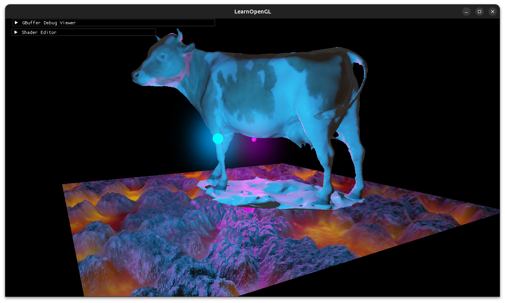

# Neerija's OpenGL Engine
A deferred rendering engine made with OpenGL.

## Current Features
  - 3D Rendering
  - Model Loading
  - PBR Materials
    - Occlusion Mapping
  - HDR
  - Bloom
## TODO
  - Screen Space Reflections?
  - Volumetric Lighting?
  - Depth of Field?
  - Anti-Aliasing..?
  - More PBR Material Support...?
  
## Architectural TODOs
  - Scene class to manage multiple models, lights, camera, etc.
  - Resource Manager to manage shaders, textures, models, etc.s

# Dependencies
- gcc and g++
```bash
sudo apt install build-essential
```
- CMake
```bash
sudo apt install cmake
```
- GLM
```bash
sudo apt install libglm-dev
```
- GLFW
```bash
sudo apt install libglfw3-dev
```
- OpenGL Mesa
```bash
sudo apt-get install libgl1-mesa-dev
sudo apt-get install libegl1-mesa-dev
```

- Assimp
```bash
sudo apt install libassimp-dev
```